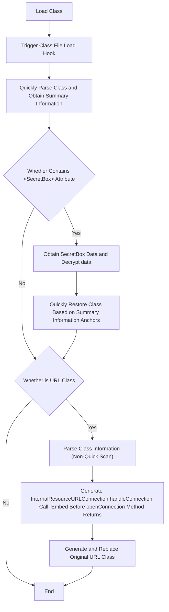
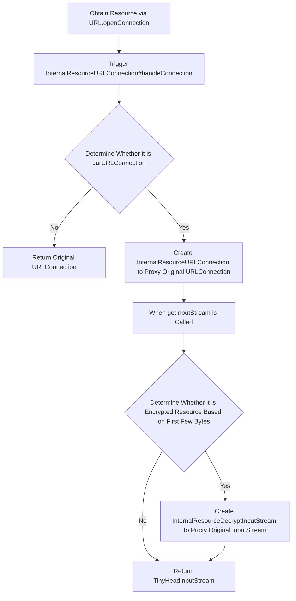

## Launcher Class Transformation Process

```mermaid
flowchart TD
A[Load Class] --> B[Trigger Class File Load Hook]
B --> C[Quickly Parse Class and Obtain Summary Information]
C --> D{"Whether Contains &lt;SecretBox&gt; Attribute"}
D --> |Yes| E[Obtain SecretBox Data and Decrypt data]
D --> |No| F{Whether is URL Class}
E --> G[Quickly Restore Class Based on Summary Information Anchors]
G --> F
F --> |Yes| H["Parse Class Information (Non-Quick Scan)"]
F --> |No| I[End]
H --> J["Generate InternalResourceURLConnection.handleConnection Call, Embed Before openConnection Method Returns"]
J --> K[Generate and Replace Original URL Class]
K --> I
```
## Resource Decryption Process

```mermaid
flowchart TD
A[Obtain Resource via URL.openConnection] --> B[Trigger InternalResourceURLConnection#handleConnection]
B --> C{Determine Whether it is JarURLConnection}
C --> |No| D[Return Original URLConnection]
C --> |Yes| E[Create InternalResourceURLConnection to Proxy Original URLConnection]
E --> G[When getInputStream is Called]
G --> F{Determine Whether it is Encrypted Resource Based on First Few Bytes}
F --> |Yes| H[Create InternalResourceDecryptInputStream to Proxy Original InputStream]
F --> |No| I[Return TinyHeadInputStream]
H --> I
```