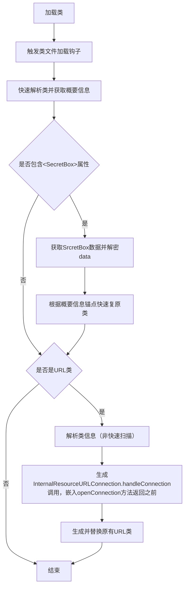
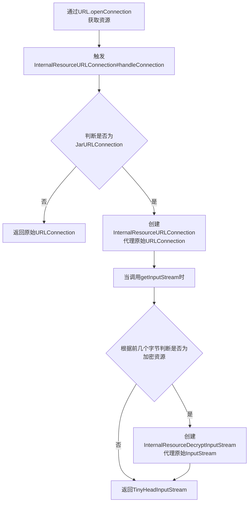

## 启动器类转换处理流程

```mermaid
flowchart TD
    A[加载类] --> B[触发类文件加载钩子]
    B --> C[快速解析类并获取概要信息]
    C --> D{"是否包含&lt;SecretBox&gt;属性"}
    D --> |是| E[获取SrcretBox数据并解密data]
    D --> |否| F{是否是URL类}
    E --> G[根据概要信息锚点快速复原类]
    G --> F
    F --> |是| H["解析类信息（非快速扫描）"]
    F --> |否| I[结束]
    H --> J["生成InternalResourceURLConnection.handleConnection调用，嵌入openConnection方法返回之前"]
    J --> K[生成并替换原有URL类]
    K --> I
```

## 资源解密流程

```mermaid
flowchart TD
    A[通过URL.openConnection获取资源] --> B[触发InternalResourceURLConnection#handleConnection]
    B --> C{判断是否为JarURLConnection}
    C --> |否| D[返回原始URLConnection]
    C --> |是| E[创建InternalResourceURLConnection代理原始URLConnection]
    E --> G[当调用getInputStream时]
    G --> F{根据前几个字节判断是否为加密资源}
    F --> |是| H[创建InternalResourceDecryptInputStream代理原始InputStream]
    F --> |否| I[返回TinyHeadInputStream]
    H --> I
```