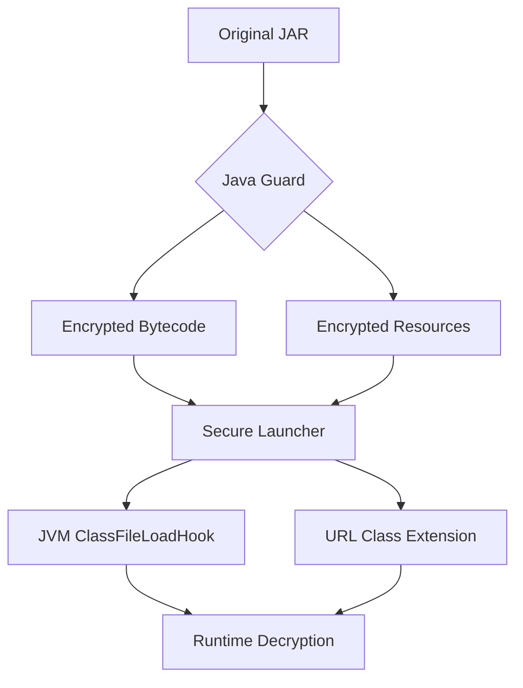

# Java Guard 🔒

[](LICENSE)
[](https://java.com)
[](https://rust-lang.org)

---
## 🌐 其他语言
- [简体中文](README.md)
---

> Java bytecode protection solution providing JAR encryption and runtime dynamic decryption capabilities, effectively preventing decompilation and code theft.
>
> Compatible with frameworks like Spring and Spring Boot that perform bytecode operations.
> 
> Mitigates the risk of decryption method exposure inherent in conventional Java agent (-javaagent) and native agent (-agentlib) approaches.
> 

> The core workflow and functionality are fully implemented. Future improvements include: documentation enhancement, JRE environment signature verification, and class execution support.

## ✨ Core Features
- **Bytecode Encryption**: AES-GCM-256 encryption for class constants and method bytecode
- **Resource Protection**: Block-level encryption for any resource files within JARs
- **Secure Launcher**: Native Rust launcher preventing decryption logic exposure
- **Signature Verification**: ED25519 signature validation ensuring code integrity
- **Zero-Intrusion**: No business code modification required

## 🚀 Quick Start

If you already have a compiled JAR package, you can ignore the Maven environment requirements and directly jump to [3. Encrypt JAR and Launch with Launcher](#3-encrypt-jar-and-launch-with-launcher)

### Requirements
- JDK 1.8+
- Maven 3.0+
- Rust 1.41+

### 1. Clone the Repository
```shell
# 1. Clone the repository
git clone --depth 1 https://github.com/kyle-derrick/java-guard.git
cd java-guard
git submodule update --init
```

#### Offline Encryption Scenario
> For offline usage, pre-cache jg-launcher dependencies (Note: Dependencies are platform-specific)

* Download dependencies in the subproject `jg-launcher`:
```shell
cd jg-launcher

# Generate/update lockfile
cargo generate-lockfile
# Download all dependency source code to vendor directory
cargo vendor ./vendor
```

* Add cargo configuration
> Windows users can perform equivalent operations
```shell
# Create the .cargo directory
mkdir .cargo

# Create the .cargo/config.toml file and write the configuration
echo "[source.crates-io]
replace-with = 'vendored-sources'

[source.vendored-sources]
directory = '$(pwd)/vendor'" > .cargo/config.toml

# Back to project root path
cd ..
```

### 2. Build java-guard
```shell
# 2. Build the project
mvn clean package
```

### 3. Encrypt JAR and Launch with Launcher

* !!! Note that jg-launcher compilation requires the *JAVA_HOME* environment variable

```shell
# 3. Generate key pair
mkdir key
ssh-keygen -t ed25519 -f key/id_ed25519

# 4. Encrypt JAR (example)
# After successfully executing java-guard, the process will automatically continue with jg-launcher compilation
java -jar target/java-guard-*.jar \
  -c ./config.yml \
  -o ./out \
  your-application.jar

# 5. Launch encrypted application
./out/jg-launcher -jar out/your-application.jar
# For Windows systems:
# .\out\jg-launcher.exe -jar out\your-application.jar
```

## ⚙️ Configuration Example
```yaml
# ./config.yml
matches: 
  - "com/yourcompany/**"     # Encryption path pattern
  - "META-INF/resources/*"

key: your_encryption_key     # AES key (optional, default to automatic generation)
privateKey: key/id_ed25519 # ED25519 private key path
publicKey: key/id_ed25519.pub # ED25519 public key path
```

## 🛡️ Workflow


## 📦 Key Features
| Feature               | Description                                                                 |
|-----------------------|-----------------------------------------------------------------------------|
| Constant & Method Encryption | Encrypts critical data while preserving class structure integrity       |
| JAR Signature Verification | Adds private key signature during encryption, verifies with public key at startup |
| Native Launcher       | Rust implementation increases reverse-engineering difficulty            |
| Transparent URL Extension | Dynamically extends bytecode to resolve encrypted resource access           |

## 🤝 Contributing
We welcome contributions through:
1. Submitting issues for bugs/feature requests
2. Forking repository and creating PRs
3. Improving documentation or adding test cases

[//]: # (Contribution guidelines pending)
[//]: # (See [CONTRIBUTING.md]&#40;CONTRIBUTING.md&#41; for details)

## 📜 License
Distributed under [MIT License](LICENSE)

## ❓ Get Help
- [Issue Tracker](https://github.com/java-guard/java-guard/issues)
- Email: feng.kyle@outlook.com