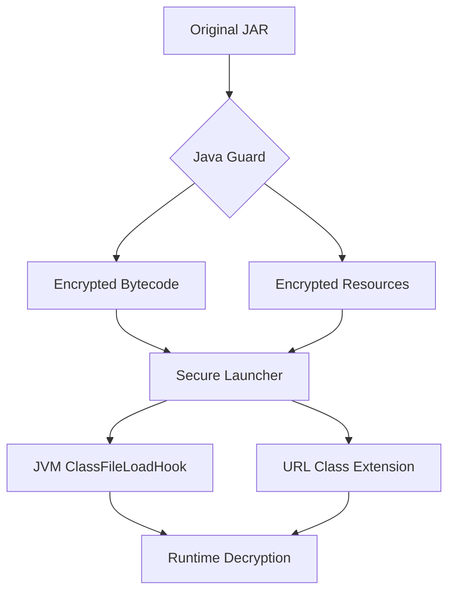

# Java Guard 🔒

[](https://github.com/kyle-derrick/java-guard/actions/workflows/ci.yml)
[](https://github.com/kyle-derrick/java-guard/actions/workflows/release.yml)
[](LICENSE)
[](https://java.com)
[](https://rust-lang.org)

---
## 🌐 Other Language
- [简体中文](README.md)
---

> A Java bytecode protection solution that provides JAR encryption and runtime dynamic decryption, making decompilation and code theft more difficult.
>
> **Supports Spring and the common startup and class-loading flow of default Spring Boot executable JARs.** With application classes under `BOOT-INF/classes` and intact dependencies under `BOOT-INF/lib`, classes are decrypted through `ClassFileLoadHook` before JVM definition without depending on the Spring Boot application ClassLoader implementation.
>
> Reduces the risk of exposing decryption logic inherent in conventional Java agent (`-javaagent`) and native agent (`-agentlib`) approaches.

> The main workflow and features are implemented. Documentation, JRE signature verification, class execution support, and other areas still need improvement.

## ✨ Core Features
- **Bytecode Encryption**: AES-GCM-256 encryption for class constants and method bytecode.
- **Resource Protection**: Block-level encryption and dynamic decryption for arbitrary resources inside JARs.
- **Secure Launcher**: A native Rust launcher keeps decryption logic outside Java code.
- **Signature Verification**: ED25519 signature validation ensures code integrity.
- **Zero-Intrusion Integration**: No business-code changes are required.
- **JVM Integration**: Launches the application directly through the JVM rather than a Java subprocess.
- **Java 8 Bytecode Target**: The project targets Java 8 bytecode. Automated CI runs `mvn clean verify` with JDK 8 on Ubuntu and only smoke-tests that build's generated CLI JAR with `--help` on JDK 8, 11, 17, and 21.
- **Java Runtime Packaging**: Injects the generated launcher into a selected JDK/JRE and creates a platform archive.

## 📥 Download a Release

Download the executable fat JAR, its SHA-256 checksum, and two clearly scoped CycloneDX JSON SBOMs from [GitHub Releases](https://github.com/kyle-derrick/java-guard/releases): `java-guard-maven-sbom.json` describes the Maven/Java component, while `jg-launcher-cargo-sbom.json` separately describes the Rust launcher from `jg-launcher/Cargo.toml` and `jg-launcher/Cargo.lock`. Neither SBOM alone covers both components. The release JAR already embeds the `jg-launcher` source, so Maven is not required to run Java Guard. Rust/Cargo and a native build toolchain are still required when generating a native launcher.

## 🚀 Quick Start

When using a release JAR, skip the Maven requirement and go directly to [3. Encrypt a JAR and generate the launcher](#3-encrypt-a-jar-and-generate-the-launcher).

### Requirements
- JDK 8 (source-build baseline); the CLI JAR generated by automated CI receives only `--help` smoke tests on JDK 8, 11, 17, and 21
- Maven 3.1+ (only when building Java Guard from source)
- Current stable Rust/Cargo (only when compiling the native launcher with `-l`)
- A native C build toolchain for the target platform

> `jg-launcher` uses the Rust 2021 edition. The previous Rust 1.41+ requirement is no longer valid; use the current stable Rust toolchain.

### 1. Clone the Repository
```shell
git clone --depth 1 https://github.com/kyle-derrick/java-guard.git
cd java-guard
git submodule update --init --recursive
```

#### Offline Usage
> For offline usage, cache the `jg-launcher` dependencies in advance. Dependencies are platform-specific.

Download the dependencies in the `jg-launcher` subproject:

```shell
cd jg-launcher
cargo generate-lockfile
cargo vendor ./vendor
```

Add the Cargo configuration:

```shell
mkdir .cargo

# Linux/macOS shell example (not an indication of macOS validation); Windows users can perform the equivalent steps
cat > .cargo/config.toml <<'EOF'
[source.crates-io]
replace-with = 'vendored-sources'

[source.vendored-sources]
directory = 'vendor'
EOF

cd ..
```

### 2. Build java-guard
```shell
mvn clean package
```

The output is:

```text
target/java-guard-0.4.3.jar
```

### 3. Encrypt a JAR and generate the launcher

Generating a native launcher requires `cargo` and an available Java environment. None of `oriJava`, `ORI_JAVA`, or `JAVA_HOME` is mandatory. Java Guard selects the Java environment to package in this order:

1. `oriJava` in the configuration file
2. The `ORI_JAVA` environment variable
3. The `JAVA_HOME` environment variable
4. The `java.home` property of the JVM currently running Java Guard

If `ORI_JAVA` is not set, Java Guard automatically tries `JAVA_HOME`; if neither is set, it uses the current JVM. `oriJava`/`ORI_JAVA` selects the JDK/JRE to package, while Cargo locates Java headers through `JAVA_HOME` or PATH when compiling the launcher. Setting the correct `JAVA_HOME` is therefore recommended for launcher builds. The launcher and packaged Java environment must use the same operating system and CPU architecture, but their JDK minor versions do not have to be identical.

```shell
# Generate an ED25519 key pair
mkdir key
ssh-keygen -t ed25519 -f key/id_ed25519

# Encrypt the JAR and explicitly enable launcher compilation and Java packaging
java -jar target/java-guard-*.jar \
  -c ./config.yml \
  -o ./out \
  -l \
  your-application.jar

# Linux/macOS shell launch command (currently validated only on Linux)
./out/bin/jg-launcher -jar out/your-application.jar

# Windows
# .\out\bin\jg-launcher.exe -jar out\your-application.jar
```

With `-l` enabled, Java Guard creates `out/bin/jg-launcher` (`.exe` on Windows) and a Java runtime archive containing the launcher:

- Windows: `out/jg-<Java-runtime-name>.zip`
- Linux/macOS: `out/jg-<Java-runtime-name>.tar.gz`

Without `-l`, Java Guard only processes the input JAR. It does not compile the launcher or package a Java environment.

### Command-Line Options

| Option | Description |
|---|---|
| `-c, --config <file>` | Configuration file; defaults to `./config.yml` |
| `-m, --mode <mode>` | Processing mode: `encrypt`, `decrypt`, or `signature`; defaults to `encrypt` |
| `-o, --output <dir>` | Output directory; falls back to the configuration value, then `./out` |
| `-l, --launcher` | Explicitly enable native launcher compilation and Java runtime packaging |
| `--skip-deps` | Skip extracting bundled offline Cargo dependencies, if present; normally unnecessary for online builds |
| `-h, --help` | Print usage information |

## ⚙️ Configuration Example
```yaml
# ./config.yml
matches:
  - "com/yourcompany/**"       # Encryption path pattern
  - "BOOT-INF/classes/com/yourcompany/*"
  - "META-INF/resources/*"

key: your_encryption_key       # AES key; may be omitted and generated during encryption
privateKey: key/id_ed25519     # ED25519 private key path
publicKey: key/id_ed25519.pub  # ED25519 public key path

output: ./out                  # Default output directory
oriJava: /path/to/jdk-or-jre   # Optional JDK/JRE directory or .zip/.tar.gz/.tgz archive
zipLevel: 6                    # Optional output JAR compression level
bufferSize: 1048576            # Optional resource-processing buffer size
printEncryptEntry: true        # Optional encrypted-entry logging
```

`oriJava` may point to a JDK/JRE directory or a `.zip`, `.tar.gz`, or `.tgz` archive. If omitted, Java Guard uses the environment-selection order described above.

## 🧩 Protected Dependency Development

Java Guard can distribute protected closed-source Java dependencies such as AI SDKs, model-orchestration libraries, agent/workflow engines, inference clients, and other core business components. An encrypted class retains API metadata such as class names, method signatures, fields, and annotations, so it can normally remain a Maven/Gradle compile-time dependency while the original implementation bytecode is stored in the encrypted payload.

Recommended workflow:

```text
Closed-source dependency JAR
  → Encrypt with fixed AES/ED25519 configuration
  → Developer compiles and packages against the protected dependency
  → Supplier signs the final executable JAR and generates its launcher
  → Run the final JAR with the matching launcher
```

```shell
# 1. The supplier encrypts the closed-source dependency
java -jar java-guard-0.4.3.jar \
  -m encrypt \
  -c ./supplier-config.yml \
  -o ./protected-deps \
  proprietary-sdk.jar

# 2. The developer builds final-app.jar using the JAR from protected-deps

# 3. After all packaging is complete, the supplier signs the final JAR
#    and generates its matching launcher
java -jar java-guard-0.4.3.jar \
  -m signature \
  -c ./supplier-config.yml \
  -o ./release \
  -l \
  final-app.jar

# 4. Launch the signed final JAR
./release/bin/jg-launcher -jar release/final-app.jar
```

Important constraints:

- Multiple protected dependencies in one application should use the same AES key and run through the application-specific launcher generated with that key.
- Plain `java -jar`, direct IDE execution, or build-time execution sees only the stub methods' default behavior. The matching launcher is required to load the real implementation.
- The common default Spring Boot executable-JAR flow is supported: encrypt the dependency first, let the Boot plugin place it intact under `BOOT-INF/lib`, and sign the final outer executable JAR afterward. When encrypting a completed Boot JAR directly, match rules must also include the relevant `BOOT-INF/lib/*.jar` entry before Java Guard can recurse into that nested dependency.
- Shade relocation, minimization, instrumentation, AOT, or other bytecode rewriting may remove the encrypted payload or change class names and is not guaranteed to work. WAR, thin-JAR, exploded-deployment, and Native Image layouts are outside the current default support scope.
- Applying `signature` to the outer JAR must be the final packaging step. Modifying its manifest, nested dependencies, or any other content afterward invalidates the signature.
- Encrypted classes are decrypted through a JVM-wide JVMTI hook and normally do not depend on the Boot nested-JAR ClassLoader implementation. Encrypted resources are transparently decrypted only when access passes through `URL.openConnection()`, returns a `jar:` `JarURLConnection`, and consumes `getInputStream()`. Direct `JarFile`/`ZipFile` access, custom protocols, and other URLConnection implementations require separate validation.
- Default Spring Boot executable JARs have been manually validated with Spring Boot 2.1.9, 3.3.13, and one 3.4-series version whose exact patch number was not recorded; this does not mean that all 3.4.x versions have been validated. The repository does not yet have an automated multi-version Spring Boot matrix. Run a startup test with the target Spring Boot/JDK version before release.
- Do not distribute the AES key, ED25519 private key, supplier configuration, or the generated `jg-launcher-source` directory to developers.

### Security Boundary

This design raises the cost of static analysis, decompilation, and routine code extraction while validating the final JAR's integrity. It does not provide absolute confidentiality on an untrusted host. A user who fully controls the launcher, JVM, native debugger, and execution machine may still recover runtime plaintext through reverse engineering, memory extraction, or a modified JVM. High-value AI models or algorithms that require a stronger trust boundary should use server-side execution, trusted execution environments, or other access-control mechanisms.

## 🛡️ Workflow

```mermaid
graph TD
A[Original JAR] --> B{Java Guard}
B --> C[Encrypted Bytecode]
B --> D[Encrypted Resources]
C --> E[Secure Launcher]
D --> E
E --> F[JVM ClassFileLoadHook]
E --> G[URL Class Extension]
F --> H[Runtime Decryption]
G --> H
```

## 📦 Features
| Feature | Description |
|---|---|
| Constant and method encryption | Encrypts critical data while preserving the class-file structure |
| JAR signature verification | Adds a private-key signature during encryption and verifies it with the public key at startup |
| Native launcher | Rust implementation increases analysis difficulty and supports capabilities such as agent-argument filtering and JAR signature validation |
| Transparent URL extension | Dynamically extends bytecode to support encrypted-resource access |
| JDK/JRE packaging | Injects the application-specific launcher into a Java environment and creates a platform archive |

## ✅ Validation Scope
- **Automated CI**: Only runs `mvn clean verify` with JDK 8 on Ubuntu and executes `--help` against the CLI JAR from that same build on JDK 8, 11, 17, and 21. It does not validate native launcher compilation, encrypted-application startup, or JDK/JRE packaging.
- **Manual end-to-end validation**: The full native launcher compilation, encrypted-application startup, and JDK/JRE packaging flow has been validated on Windows and Linux.
- **Manual Spring Boot validation**: Default executable JARs have been validated with Spring Boot 2.1.9, 3.3.13, and one 3.4-series version whose exact patch number was not recorded. This must not be interpreted as validation of all 3.4.x versions.
- **Not tested**: macOS has not yet been manually validated. The launcher is compiled for the current Rust target, so it must match the operating system and CPU architecture of the packaged JDK/JRE.

## 🚀 Roadmap
- **Automate existing validation**: Add automation for the existing Windows/Linux native launcher compilation, encrypted-application startup, JDK/JRE packaging, and Spring Boot manual validation, recording the CPU architecture of each test environment.
- **Expand platform and path coverage**: Add macOS coverage and tests for representative Spring Boot executable-JAR layouts, nested dependencies, and encrypted-resource loading paths.
- **JRE and classpath JAR signature verification**: Improve runtime integrity validation
- **Anti-disassembly detection and protection**: Add detection and protection against disassembly attempts

## 🤝 Contributing
Contributions are welcome through:
1. Issues for bug reports and feature requests
2. Forks and pull requests
3. Documentation improvements and test cases

## 📜 License
Distributed under the [MIT License](LICENSE).

## ❓ Get Help
- [Issue Tracker](https://github.com/kyle-derrick/java-guard/issues)
- Email: feng.kyle@outlook.com
