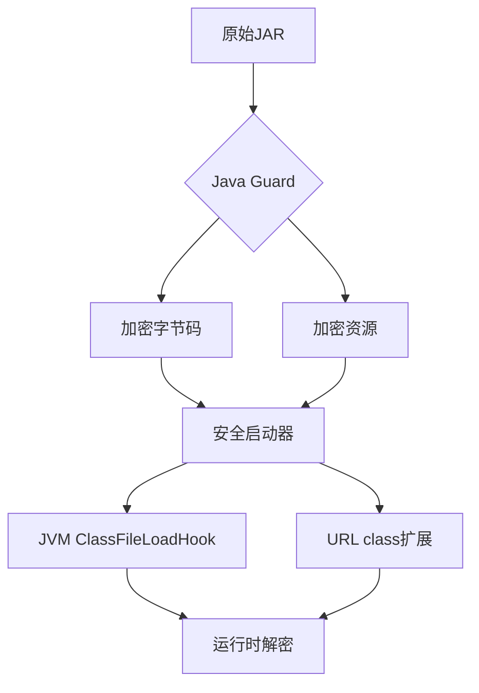

# Java Guard 🔒

[](LICENSE)
[](https://java.com)
[](https://rust-lang.org)

---
## 🌐 Other Language
- [English](README.en.md)
---

> Java字节码保护解决方案，提供JAR包加密与运行时动态解密能力，有效防止反编译和代码窃取。
>
> 降低了传统Java代理（-javaagent）和本机代理（-agentlib）方法中固有的解密方法暴露的风险。
> 

> 目前主要将完整流程及功能实现了出来，后续还需进一步完善，比如：注释、文档、jre环境签名校验、class执行支持等。
>

## ✨ 核心功能
- **字节码加密**：对Class文件常量和方法字节码进行AES-GCM-256加密
- **资源文件保护**：支持Jar内任意资源文件的块加密与动态解密
- **安全启动器**：通过Rust实现的Native启动器防止解密逻辑暴露
- **签名校验**：集成ED25519签名验证确保代码完整性
- **零侵入集成**：无需修改业务代码，透明化保护流程

## 🚀 快速开始
### 环境要求
- JDK 1.8+
- Maven 3.0+
- Rust 1.41+

### 1. 克隆仓库
```shell
# 1. 克隆仓库
git clone https://github.com/java-guard/java-guard.git
cd java-guard
git submodule update --init
```

#### 离线加密场景
> 如果需要离线场景使用可提前缓存jg-launcher依赖（注意：依赖与系统平台相关）
> 

* 在子项目 jg-launcher 中下载依赖：

```shell
cd jg-launcher

# 生成/更新锁文件
cargo generate-lockfile
# 下载所有依赖源码到vendor目录
cargo vendor ./vendor
```

* 添加cargo配置
> windows 用户可自行使用同等操作
```shell
# 创建 .cargo 目录
mkdir .cargo

# 创建 .cargo/config.toml 文件，并写入配置
echo "[source.crates-io]
replace-with = 'vendored-sources'

[source.vendored-sources]
directory = 'vendor'" > .cargo/config.toml

# 回到项目根目录
cd ..
```

### 2. 编译java-guard
```shell
# 2. 编译项目
mvn clean package
```

### 3. 加密jar及使用launcher启动
```shell
# 3. 生成密钥对
ssh-keygen -t ed25519 -f config/id_ed25519

# 4. 加密JAR（示例）
java -jar target/java-guard-*.jar \
  -c config.yml \
  -o out \
  your-application.jar

# 5. 启动加密应用
./out/jg-launcher -jar out/your-application.jar
# 如果你的系统是windows:
# .\out\jg-launcher.exe -jar out\your-application.jar
```

## ⚙️ 配置示例
```yaml
# config.yml
matches: 
  - "com/yourcompany/**"     # 加密路径匹配规则
  - "META-INF/resources/*"

key: your_encryption_key     # AES加密密钥（可选）
privateKey: config/id_ed25519 # ED25519私钥路径
publicKey: config/id_ed25519.pub # ED25519公钥路径
```

## 🛡️ 整体流程


## 📦 特性
| 特性        | 说明                                                   |
|-----------|------------------------------------------------------|
| 常量及方法代码加密 | 加密关键数据，跳过关键结构常量，防止破坏类格式                              |
| Jar签名校验   | 加密时附加私钥签名，启动时公钥校验签名验证是否可信（后续可增加Java环境签名校验避免自定义Jdk运行） |
| Native启动器 | Rust实现，增加破解难度，且可以做到更多检测或拦截等操作，比如agent参数拦截、jar签名校验等。  |
| URL类无感扩展  | 动态扩展字节码化解密资源访问问题                                     |

## 🤝 贡献指南
欢迎通过以下方式参与贡献：
1. 提交Issue报告问题或建议
2. Fork仓库并提交Pull Request
3. 完善文档或添加测试用例

[//]: # (因为暂时还没写贡献规范 -_-)
[//]: # (请阅读[贡献规范]&#40;CONTRIBUTING.md&#41;了解详细流程。)

## 📜 许可证
本项目采用 [MIT License](LICENSE)

## ❓ 获取帮助
- [问题追踪](https://github.com/java-guard/java-guard/issues)
- 邮箱：feng.kyle@outlook.com