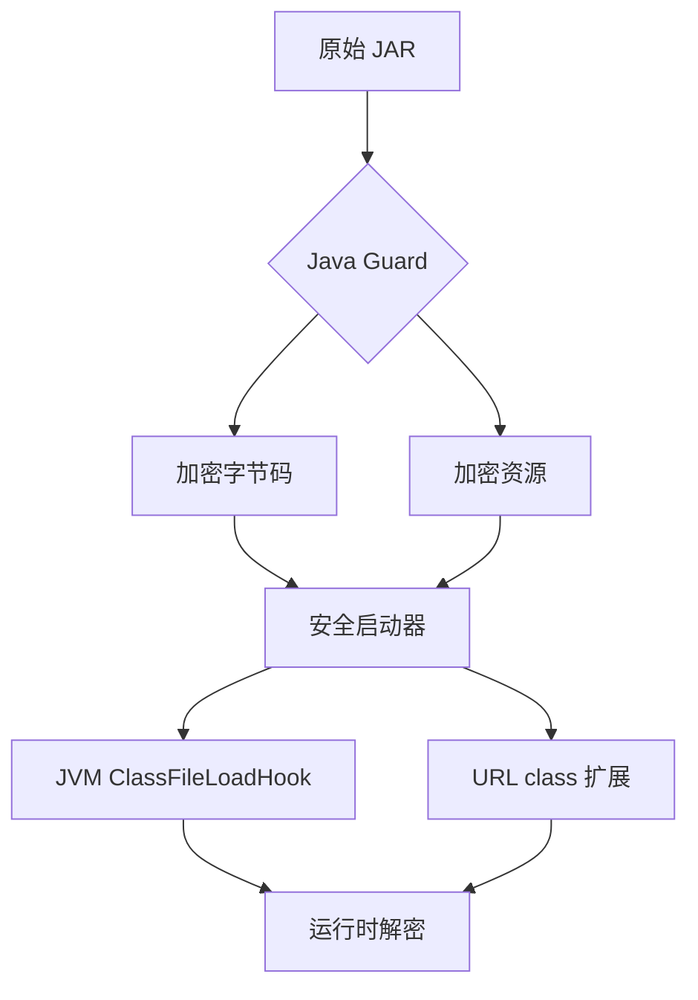

# Java Guard 🔒

[](https://github.com/kyle-derrick/java-guard/actions/workflows/ci.yml)
[](https://github.com/kyle-derrick/java-guard/actions/workflows/release.yml)
[](LICENSE)
[](https://java.com)
[](https://rust-lang.org)

---
## 🌐 Other Language
- [English](README.en.md)
---

> Java 字节码保护解决方案，提供 JAR 包加密与运行时动态解密能力，有效增加反编译和代码窃取的难度。
>
> **支持 Spring 以及 Spring Boot 默认可执行 JAR 的常见启动和类加载流程**：应用类位于 `BOOT-INF/classes`、依赖原样位于 `BOOT-INF/lib` 时，class 会在 JVM 定义前通过 `ClassFileLoadHook` 解密，不依赖 Spring Boot 的应用 ClassLoader 实现。
>
> 降低传统 Java 代理（`-javaagent`）和本机代理（`-agentlib`）方案中解密方法暴露的风险。

> 目前主要将完整流程及功能实现了出来，后续还需进一步完善，比如：注释、文档、JRE 环境签名校验、class 执行支持等。

## ✨ 核心功能
- **字节码加密**：对 Class 文件常量和方法字节码进行 AES-GCM-256 加密。
- **资源文件保护**：支持 JAR 内任意资源文件的块加密与动态解密。
- **安全启动器**：通过 Rust 实现的 Native 启动器防止解密逻辑暴露。
- **签名校验**：集成 ED25519 签名验证确保代码完整性。
- **零侵入集成**：无需修改业务代码，透明化保护流程。
- **JVM 集成**：直接调用 JVM 启动应用，而非通过子进程调用 Java。
- **Java 8 字节码目标**：项目以 Java 8 为编译目标；自动化 CI 在 Ubuntu 上使用 JDK 8 执行 `mvn clean verify`，并仅对该次构建生成的 CLI JAR 在 JDK 8、11、17、21 上执行 `--help` 冒烟测试。
- **Java 环境打包**：生成启动器时，可将其写入指定 JDK/JRE 并生成平台压缩包。

## 📥 获取发行包

可从 [GitHub Releases](https://github.com/kyle-derrick/java-guard/releases) 下载已打包的可执行 fat JAR、SHA-256 校验文件及两个范围明确的 CycloneDX JSON SBOM：`java-guard-maven-sbom.json` 描述 Maven/Java 组件，`jg-launcher-cargo-sbom.json` 则根据 `jg-launcher/Cargo.toml` 和 `jg-launcher/Cargo.lock` 单独描述 Rust launcher；任一 SBOM 都不能单独代表两个组件。发行包已经内嵌 `jg-launcher` 源码，无需 Maven 即可执行 Java Guard；生成 Native 启动器时仍需要 Rust/Cargo 和本机编译工具链。

## 🚀 快速开始

若使用已发布的 JAR，可忽略 Maven 要求并直接跳至 [3. 加密 JAR 并生成 launcher](#3-加密-jar-并生成-launcher)。

### 环境要求
- JDK 8（源码构建基线）；自动化 CI 生成的 CLI JAR 仅在 JDK 8、11、17、21 上进行 `--help` 冒烟测试
- Maven 3.1+（仅源码构建 Java Guard 时需要）
- 当前 stable Rust/Cargo（仅使用 `-l` 编译 Native 启动器时需要）
- 对应平台的本机 C 编译工具链

> `jg-launcher` 使用 Rust 2021 edition，旧文档中的 Rust 1.41+ 已不再适用，建议使用当前 stable Rust。

### 1. 克隆仓库
```shell
git clone --depth 1 https://github.com/kyle-derrick/java-guard.git
cd java-guard
git submodule update --init --recursive
```

#### 离线加密场景
> 如果需要离线使用，可提前缓存 `jg-launcher` 依赖（注意：依赖与系统平台相关）。

在子项目 `jg-launcher` 中下载依赖：

```shell
cd jg-launcher
cargo generate-lockfile
cargo vendor ./vendor
```

添加 Cargo 配置：

```shell
mkdir .cargo

# Linux/macOS shell 命令示例（不表示已在 macOS 验证）；Windows 用户可执行同等操作
cat > .cargo/config.toml <<'EOF'
[source.crates-io]
replace-with = 'vendored-sources'

[source.vendored-sources]
directory = 'vendor'
EOF

cd ..
```

### 2. 编译 java-guard
```shell
mvn clean package
```

输出文件为：

```text
target/java-guard-0.4.0.jar
```

### 3. 加密 JAR 并生成 launcher

生成 Native launcher 需要 `cargo` 可用，并需要可用的 Java 环境。`oriJava`、`ORI_JAVA` 和 `JAVA_HOME` 都不是必填项，打包目标 Java 环境按以下优先级选择：

1. 配置文件中的 `oriJava`
2. 环境变量 `ORI_JAVA`
3. 环境变量 `JAVA_HOME`
4. 当前运行 Java Guard 的 JVM 的 `java.home`

因此，未指定 `ORI_JAVA` 时会自动尝试 `JAVA_HOME`；两者都未指定时会使用当前 JVM。`oriJava`/`ORI_JAVA` 只负责选择最终打包的 JDK/JRE，Cargo 编译 launcher 时仍通过 `JAVA_HOME` 或 PATH 定位 Java 头文件，建议为 launcher 编译设置正确的 `JAVA_HOME`。launcher 与被打包 Java 环境的操作系统和 CPU 架构必须一致，但 JDK 小版本不要求完全一致。

```shell
# 生成 ED25519 密钥对
mkdir key
ssh-keygen -t ed25519 -f key/id_ed25519

# 加密 JAR，并显式启用 launcher 编译和 Java 环境打包
java -jar target/java-guard-*.jar \
  -c ./config.yml \
  -o ./out \
  -l \
  your-application.jar

# Linux/macOS shell 启动命令（当前仅在 Linux 验证）
./out/bin/jg-launcher -jar out/your-application.jar

# Windows
# .\out\bin\jg-launcher.exe -jar out\your-application.jar
```

启用 `-l` 后，除 `out/bin/jg-launcher`（Windows 为 `.exe`）外，还会生成包含 launcher 的 Java 环境包：

- Windows：`out/jg-<Java环境名>.zip`
- Linux/macOS：`out/jg-<Java环境名>.tar.gz`

不传 `-l` 时，仅处理输入 JAR，不编译 launcher，也不打包 Java 环境。

### 命令行参数

| 参数 | 说明 |
|---|---|
| `-c, --config <file>` | 配置文件，默认 `./config.yml` |
| `-m, --mode <mode>` | 处理模式：`encrypt`、`decrypt` 或 `signature`，默认 `encrypt` |
| `-o, --output <dir>` | 输出目录；未指定时使用配置值，默认 `./out` |
| `-l, --launcher` | 显式启用 Native launcher 编译和 Java 环境打包 |
| `--skip-deps` | 跳过释放 JAR 内可能包含的离线 Cargo 依赖；正常在线构建通常无需使用 |
| `-h, --help` | 显示帮助 |

## ⚙️ 配置示例
```yaml
# ./config.yml
matches:
  - "com/yourcompany/**"       # 加密路径匹配规则
  - "META-INF/resources/*"

key: your_encryption_key       # AES 密钥；加密时可省略并自动生成
privateKey: key/id_ed25519     # ED25519 私钥路径
publicKey: key/id_ed25519.pub  # ED25519 公钥路径

output: ./out                  # 默认输出目录
oriJava: /path/to/jdk-or-jre   # 可选：JDK/JRE 目录或 .zip/.tar.gz/.tgz 包
zipLevel: 6                    # 可选：输出 JAR 压缩级别
bufferSize: 1048576            # 可选：资源处理缓冲区大小
printEncryptEntry: true        # 可选：打印加密条目
```

`oriJava` 可以是 JDK/JRE 目录，也可以是 `.zip`、`.tar.gz` 或 `.tgz` 压缩包。若省略，则按前述环境变量优先级自动选择。

## 🧩 加密依赖开发场景

Java Guard 可用于向开发者提供经过保护的闭源 Java 依赖，例如 AI SDK、模型编排库、Agent/工作流引擎、推理客户端及其他核心业务组件。加密后的 class 会保留类名、方法签名、字段、注解等 API 元数据，通常可以作为 Maven/Gradle 依赖参与下游项目的编译和打包，而原始实现字节码保存在加密载荷中。

推荐流程：

```text
闭源依赖 JAR
  → 使用固定 AES/ED25519 配置加密
  → 开发者基于加密依赖编译、打包
  → 供应方对最终可执行 JAR 做 signature 签名并生成 launcher
  → 使用匹配的 launcher 启动最终 JAR
```

```shell
# 1. 供应方加密闭源依赖
java -jar java-guard-0.4.0.jar \
  -m encrypt \
  -c ./supplier-config.yml \
  -o ./protected-deps \
  proprietary-sdk.jar

# 2. 开发者使用 protected-deps 中的 JAR 编译并生成 final-app.jar

# 3. 供应方在所有打包步骤完成后，对最终 JAR 签名并生成匹配的 launcher
java -jar java-guard-0.4.0.jar \
  -m signature \
  -c ./supplier-config.yml \
  -o ./release \
  -l \
  final-app.jar

# 4. 使用 launcher 启动签名后的最终 JAR
./release/bin/jg-launcher -jar release/final-app.jar
```

使用时需注意：

- 一个最终应用中的多个加密依赖应使用同一 AES 密钥，并由使用该密钥生成的应用专用 launcher 运行。
- 普通 `java -jar`、IDE 直接运行或构建期间执行加密依赖，只会得到 stub 方法的默认行为；真实实现必须通过匹配的 launcher 加载。
- Spring Boot 默认可执行 JAR 场景已按常见流程支持：建议先加密依赖，再由 Boot 插件将其原样放入 `BOOT-INF/lib`，最后签名外层可执行 JAR。若直接加密最终 Boot JAR，匹配规则还必须覆盖对应的 `BOOT-INF/lib/*.jar` entry，Java Guard 才会递归处理嵌套依赖。
- Shade 重定位、最小化、插桩、AOT 或其他字节码重写可能丢失加密载荷或改变类名，不保证可用；WAR、thin JAR、exploded deployment 和 Native Image 也不属于当前默认支持范围。
- 外层 JAR 的 `signature` 必须是最后一个打包步骤；签名后修改 manifest、嵌套依赖或其他内容都会导致校验失败。
- 加密 class 通过 JVM 级 JVMTI hook 解密，通常不受 Boot nested-JAR ClassLoader 实现影响。加密资源目前仅在访问经过 `URL.openConnection()`、返回 `jar:` `JarURLConnection` 并通过 `getInputStream()` 读取时透明解密；直接使用 `JarFile`/`ZipFile`、自定义协议或其他 URLConnection 的路径需要单独验证。
- 默认 Spring Boot 可执行 JAR 已手工验证 Spring Boot 2.1.9、3.3.13，以及 3.4 系列中一个未记录确切补丁号的版本；这不表示全部 3.4.x 版本均已验证。仓库尚未建立 Spring Boot 多版本自动化矩阵，建议针对目标 Spring Boot/JDK 版本进行发布前启动测试。
- 不应向开发者分发 AES 密钥、ED25519 私钥、供应方配置文件或生成目录中的 `jg-launcher-source`。

### 安全边界

该方案用于提高静态分析、反编译和常规代码提取的成本，并校验最终 JAR 的完整性；它不等同于在不可信主机上提供绝对保密。如果使用者完全控制 launcher、JVM、Native 调试器和运行主机，仍可能通过逆向、内存提取或定制 JVM 获取运行时明文。对于必须建立更强安全边界的高价值 AI 模型或算法，建议采用服务端执行、可信执行环境或其他访问控制方案。

## 🛡️ 整体流程

```mermaid
graph TD
A[原始 JAR] --> B{Java Guard}
B --> C[加密字节码]
B --> D[加密资源]
C --> E[安全启动器]
D --> E
E --> F[JVM ClassFileLoadHook]
E --> G[URL class 扩展]
F --> H[运行时解密]
G --> H
```

## 📦 特性
| 特性 | 说明 |
|---|---|
| 常量及方法代码加密 | 加密关键数据，跳过关键结构常量，避免破坏 class 格式 |
| JAR 签名校验 | 加密时附加私钥签名，启动时使用公钥校验签名 |
| Native 启动器 | Rust 实现，增加分析难度，并支持 agent 参数拦截、JAR 签名校验等能力 |
| URL 类无感扩展 | 动态扩展字节码，解决加密资源访问问题 |
| JDK/JRE 打包 | 把应用专用 launcher 写入 Java 环境并生成平台压缩包 |

## ✅ 验证范围
- **自动化 CI**：仅在 Ubuntu 上使用 JDK 8 执行 `mvn clean verify`，并对同一次构建生成的 CLI JAR 在 JDK 8、11、17、21 上运行 `--help`；不包含 Native launcher 编译、加密应用启动或 JDK/JRE 打包验证。
- **手工端到端验证**：已在 Windows 和 Linux 完成 Native launcher 编译、加密应用实际启动以及 JDK/JRE 打包的完整流程验证。
- **Spring Boot 手工验证**：默认可执行 JAR 已验证 Spring Boot 2.1.9、3.3.13，以及 3.4 系列中一个未记录确切补丁号的版本；不得据此推断全部 3.4.x 版本均已验证。
- **尚未验证**：macOS 尚未完成手工验证。launcher 会按当前 Rust target 编译，使用时应确保 launcher 与被打包 JDK/JRE 的操作系统和 CPU 架构一致。

## 🚀 后续计划
- **自动化现有验证**：将现有 Windows/Linux Native launcher 编译、加密应用实际启动、JDK/JRE 打包和 Spring Boot 手工验证纳入自动化测试，并记录测试环境的 CPU 架构。
- **扩展平台与路径覆盖**：补充 macOS，以及代表性的 Spring Boot 可执行 JAR 布局、嵌套依赖和加密资源读取路径测试。
- **JRE 环境及 classpath 下 JAR 文件签名校验**：增强运行时安全校验机制
- **反汇编检测与防护机制**：增加对代码反汇编行为的检测和防护能力

## 🤝 贡献指南
欢迎通过以下方式参与贡献：
1. 提交 Issue 报告问题或建议
2. Fork 仓库并提交 Pull Request
3. 完善文档或添加测试用例

## 📜 许可证
本项目采用 [MIT License](LICENSE)。

## ❓ 获取帮助
- [问题追踪](https://github.com/kyle-derrick/java-guard/issues)
- 邮箱：feng.kyle@outlook.com
